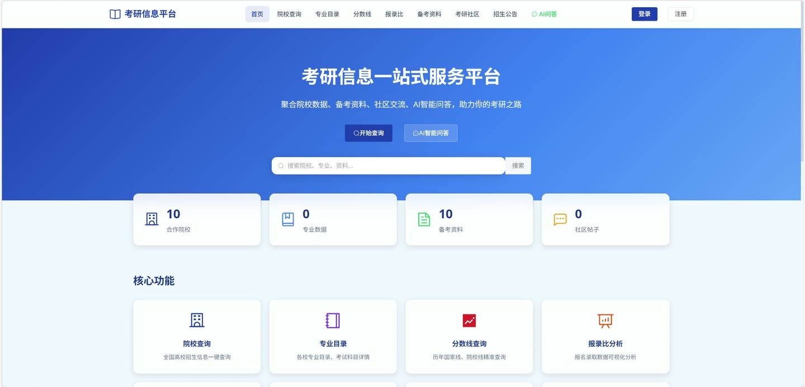
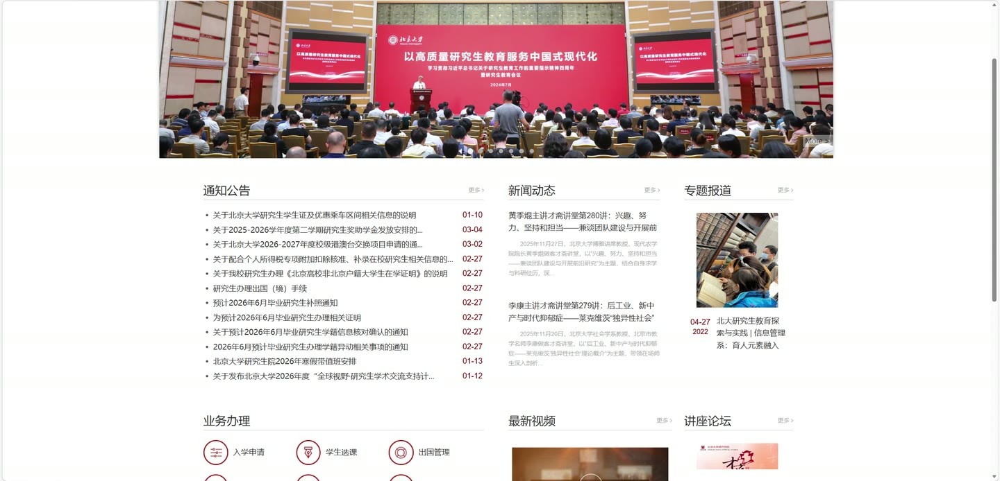
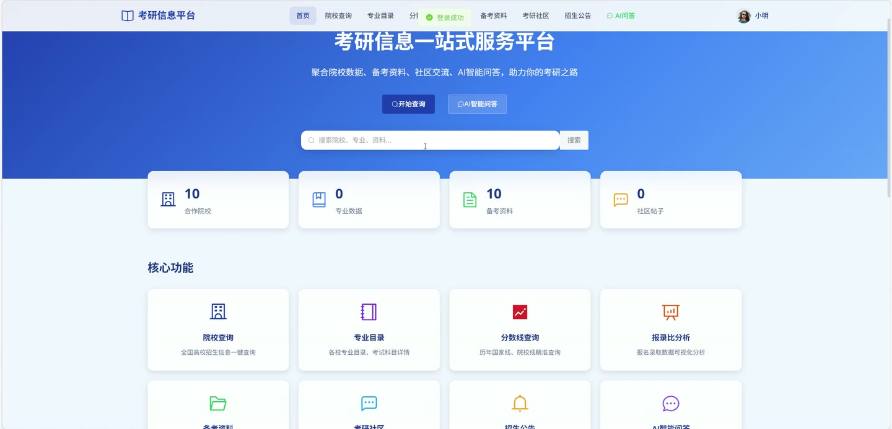
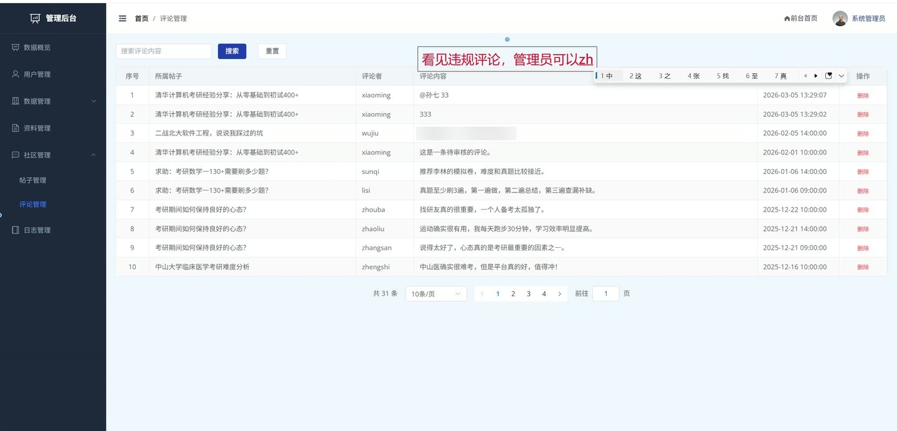
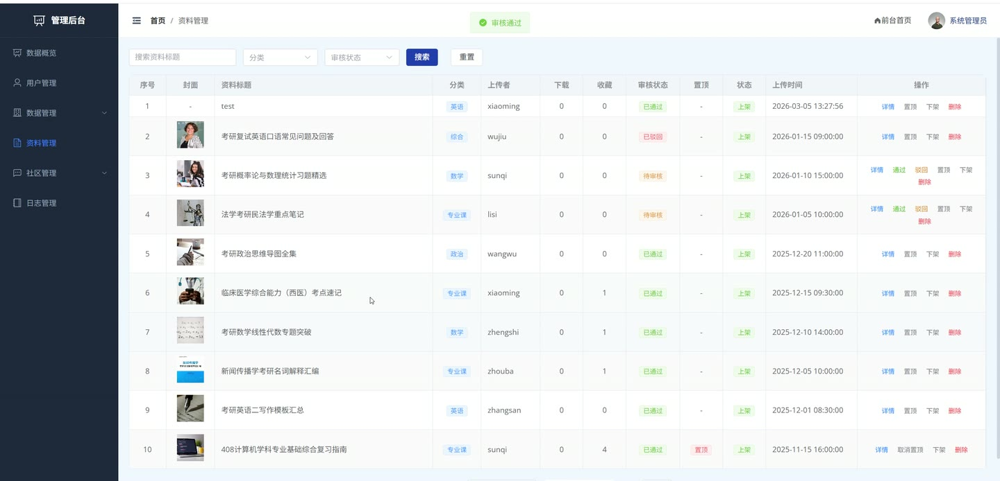
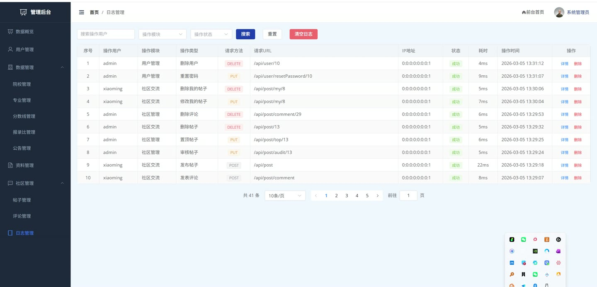

# (附文档)Springboot3+Vue3+MySQL Deepseek 大模型的考研信息平台

**技术栈**：Springboot3、Vue3、MySQL

### 系统简介

本系统是一个基于 Spring Boot 3 + Vue 3 + MySQL 的前后端分离信息平台，集成 Deepseek 大模型实现 AI 智能问答。系统包含管理员和考生两种角色，提供院校专业查询、报录比与分数线管理、备考资料分享、社区交流互动、AI 智能问答、招生公告管理、个人中心等功能模块，为用户提供一站式的信息查询与学习交流服务。
 
### 核心功能
 
### 管理员端

 
- 仪表盘统计：查看用户总数、院校总数、资料总数、帖子总数、待审核资料数、待审核帖子数，以及资料分类统计（政治/英语/数学/专业课/综合）和帖子分类统计（经验分享/问题求助/备考心得/院校讨论/其他） 
- 院校管理：新增、修改、删除院校信息（包含名称、代码、省份、城市、类型、官网、研究生院网址、简介、图片）；分页查询院校列表（支持按名称/省份/类型筛选）；获取所有院校列表供下拉选择 
- 专业管理：新增、修改、删除专业信息（包含专业代码、名称、所属学院、学科门类、学位类型、学制、研究方向、考试科目、招生人数、年份）；分页查询专业列表（支持按院校/名称/类别/年份筛选） 
- 报录比管理：新增、修改、删除报录比数据（包含报名人数、录取人数、报录比、推免人数、年份）；分页查询报录比列表（支持按院校/专业/年份筛选），自动显示院校名称和专业名称 
- 分数线管理：新增、修改、删除分数线数据（包含总分线、政治线、英语线、专业课一线、专业课二线、类型、年份）；分页查询分数线列表（支持按院校/专业/年份/类型筛选） 
- 招生公告管理：新增、修改、删除公告（包含标题、内容、类型、年份、来源链接、状态）；分页查询公告列表（支持按院校/类型/年份/关键字筛选）；查看公告详情 
- 备考资料管理：分页查询资料列表（支持按类别/审核状态/关键字筛选）；审核资料（通过/驳回，驳回需填写原因）；置顶/取消置顶资料；上架/下架资料；删除资料 
- 社区帖子管理：分页查询帖子列表（支持按类别/审核状态/关键字筛选）；审核帖子（通过/驳回）；置顶/取消置顶帖子；删除帖子 
- 评论管理：分页查询评论列表（支持按审核状态筛选）；审核评论（通过/驳回）；删除评论 
- 用户管理：分页查询用户列表（支持按用户名/角色/状态筛选）；新增用户；修改用户信息；修改用户状态（启用/禁用）；重置用户密码为 123456；删除用户 
- 操作日志：分页查询操作日志（支持按用户名/模块/状态筛选）；删除单条日志；清空所有日志
 
### 考生端

 
- 用户注册与登录：填写用户名、密码、昵称等信息完成注册；使用用户名和密码登录系统 
- 个人中心：查看和修改个人信息（昵称、头像、邮箱、手机、性别、个人简介、目标院校、目标专业）；修改登录密码（需输入旧密码和新密码） 
- 院校查询：浏览院校列表（支持按名称/省份/类型分页筛选）；查看院校详情（包含基本信息、官网链接、院校简介等） 
- 专业查询：浏览专业列表（支持按院校/名称/类别/年份分页筛选）；查看专业详情（包含专业代码、所属学院、学位类型、学制、研究方向、考试科目、招生人数等） 
- 报录比查询：浏览报录比列表（支持按院校/专业/年份筛选），查看报名人数、录取人数、报录比、推免人数等数据 
- 分数线查询：浏览分数线列表（支持按院校/专业/年份/类型筛选），查看总分线、政治线、英语线、专业课线等数据 
- 招生公告浏览：查看正常状态的公告列表（支持按院校/类型/年份/关键字筛选）；查看公告详情 
- 备考资料：浏览前台资料列表（支持按类别/关键字筛选，可按最新/最热排序）；查看资料详情（包含标题、描述、分类、文件信息、下载次数、收藏次数等）；上传资料（填写标题、描述、分类、标签、文件路径、封面等）；修改自己的资料（修改后需重新审核）；删除自己的资料；下载资料（自动增加下载次数）；收藏/取消收藏资料；查看我的收藏列表；评价资料（填写评价内容和评分 1-5）；查看资料评价列表 
- 社区交流：浏览前台帖子列表（支持按类别/关键字筛选）；发布帖子（填写标题、内容、图片、分类）；修改自己的帖子（修改后需重新审核）；删除自己的帖子；查看帖子详情（包含标题、内容、作者、分类、浏览次数、点赞数、评论数等）；点赞/取消点赞帖子；发表评论（支持回复评论，填写评论内容）；查看帖子评论列表（树形结构） 
- AI 智能问答：发送消息给 AI 助手（基于 Deepseek 大模型），获取相关问题的专业回答；查看当前会话的历史消息；查看所有会话列表（显示会话标题和最后时间）；删除指定会话
 
### 技术栈

 后端框架Spring Boot 3 ORM 框架MyBatis-Plus 权限认证JWT Token 拦截器 前端框架Vue 3 状态管理Pinia 构建工具Vite 数据库MySQL AI 集成Deepseek API（OkHttp 调用） 文件上传本地文件存储
 
### 交付内容

 
- 后端完整源码 
- 前端完整源码 
- 数据库初始化脚本 
- 万字文档

## 界面展示

---

## 获取完整源码 + 万字文档

本仓库为项目介绍页。**完整前后端源码、数据库初始化脚本、万字项目文档**，请访问 [codekk.top](http://codekk.top) 获取。

可作课程设计 / 毕业设计参考，支持远程部署调试。